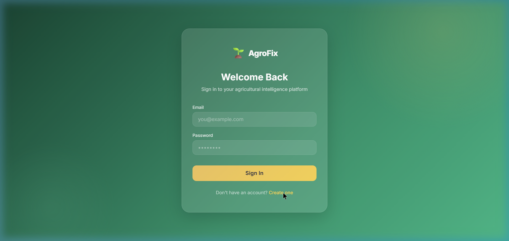
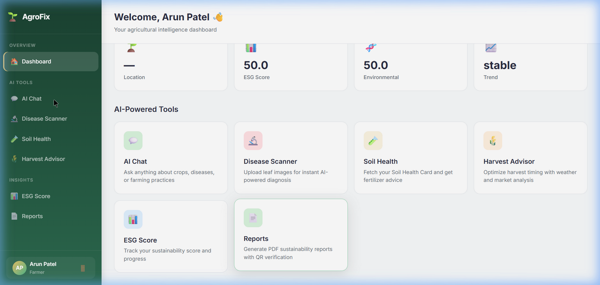
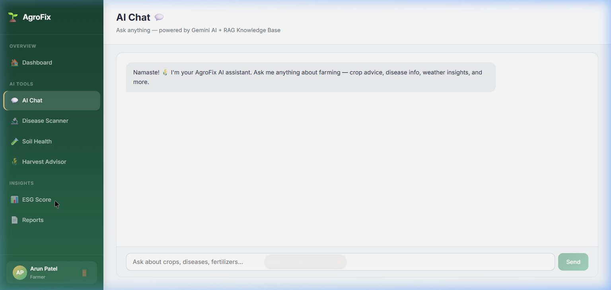

# 🌱 AgroFix — AI-Powered Agricultural Intelligence Platform

A comprehensive AI-powered platform for Indian farmers featuring crop advisory, disease detection, soil health analysis, harvest optimization, ESG scoring, and more — all powered by **Google Gemini AI** and a custom **ResNet9** model.

---

## ✨ Features

| Feature | Description |
|---------|-------------|
| 💬 **AI Chat** | Natural language farming Q&A powered by Gemini + RAG Knowledge Base |
| 🔬 **Disease Scanner** | Upload leaf photos for instant AI-powered disease detection (ResNet9 + PlantVillage) |
| 🧪 **Soil Health** | Fetch Soil Health Card data and get AI fertilizer recommendations |
| 🌾 **Harvest Advisor** | Optimize harvest timing with weather, market, and scenario analysis |
| 📊 **ESG Score** | Track environmental, social, and governance sustainability scores |
| 📄 **Reports** | Generate PDF sustainability reports with QR code verification |
| 🛡 **Pesticide Verification** | Verify pesticide authenticity via OCR + database checks |
| 🌍 **Digital Twin** | Geo-spatial farm risk visualization |
| 🔐 **Auth System** | JWT-based login with role-based access (Farmer / Manager) |
| 📈 **Manager Dashboard** | Platform-wide analytics and farmer management |

---

## 📸 Screenshots

### Login Page
Beautiful glassmorphism design with earthy green gradient background.



### Farmer Dashboard & AI Chat
Role-aware sidebar navigation with quick access to all AI tools.



### ESG Sustainability Score
Animated circular ring chart with E/S/G breakdown and action logging.



### 🎬 Demo Recording
Full registration → dashboard → chat → ESG flow walkthrough:


---

## 🏗 Tech Stack

| Layer | Technology |
|-------|-----------|
| **Backend** | Python, FastAPI, Uvicorn |
| **Database** | SQLite (SQLAlchemy + aiosqlite) |
| **Vector DB** | ChromaDB (RAG knowledge base) |
| **AI/LLM** | Google Gemini 2.0 Flash |
| **ML Model** | PyTorch ResNet9 (PlantVillage dataset, 38 disease classes) |
| **OCR** | EasyOCR (pesticide label reading) |
| **Auth** | JWT (python-jose) + bcrypt password hashing |
| **Frontend** | React 19, Vite, React Router |
| **Styling** | Vanilla CSS with glassmorphism, animations, Inter font |
| **PDF** | ReportLab + QR code generation |
| **Container** | Docker, Docker Compose |

---

## 🚀 Quick Start

### Prerequisites
- Python 3.10+
- Node.js 18+
- A [Gemini API Key](https://aistudio.google.com/apikey)

### 1. Clone & Setup Backend

```bash
git clone https://github.com/Ayushsaini-exe/geminathon.git
cd geminathon

# Create virtual environment
python -m venv .venv
.venv/Scripts/activate   # Windows
# source .venv/bin/activate  # Linux/Mac

# Install dependencies
pip install -r requirements.txt
```

### 2. Configure Environment

```bash
cp .env.example .env
# Edit .env and add your GEMINI_API_KEY
```

### 3. Build Frontend

```bash
cd frontend
npm install
npm run build
cd ..
```

### 4. Run

```bash
python -m uvicorn app.main:app --host 127.0.0.1 --port 8000
```

Open **http://127.0.0.1:8000** → Register as Farmer or Manager → Start using the platform!

### 5. Development Mode (Hot Reload)

```bash
# Terminal 1 — Backend
python -m uvicorn app.main:app --host 127.0.0.1 --port 8000 --reload

# Terminal 2 — Frontend (with API proxy)
cd frontend && npm run dev
```

Frontend dev server runs on `http://localhost:5173` with API calls proxied to the backend.

---

## 📁 Project Structure

```
agrofix/
├── app/
│   ├── main.py              # FastAPI app + static file serving
│   ├── core/
│   │   ├── config.py         # Settings (env vars)
│   │   ├── auth.py           # JWT utils, password hashing, auth deps
│   │   └── logging.py        # Structured logging
│   ├── api/                  # API routes
│   │   ├── auth.py           # Register, Login, /me
│   │   ├── farmers.py        # CRUD
│   │   ├── orchestrator.py   # AI intent routing
│   │   ├── rag.py            # RAG advisory
│   │   ├── shc.py            # Soil Health Card
│   │   ├── pesticide.py      # Pesticide verification
│   │   ├── vision.py         # Disease detection
│   │   ├── harvest.py        # Harvest optimization
│   │   ├── esg.py            # ESG scoring
│   │   ├── digital_twin.py   # Farm twin
│   │   ├── report.py         # PDF reports
│   │   └── manager.py        # Manager-only routes
│   ├── services/             # Business logic
│   ├── schemas/              # Pydantic models
│   ├── orchestrator/         # AI intent classifier
│   └── models/               # ML model weights (.pth)
├── database/
│   ├── models.py             # SQLAlchemy ORM (11 models)
│   └── session.py            # Async DB session
├── vectorstore/
│   └── chroma_setup.py       # ChromaDB integration
├── frontend/                 # React + Vite
│   ├── src/
│   │   ├── App.jsx           # Router + protected routes
│   │   ├── index.css         # Design system (700+ lines)
│   │   ├── api/client.js     # JWT-authenticated fetch wrapper
│   │   ├── context/AuthContext.jsx
│   │   ├── components/Layout.jsx
│   │   └── pages/
│   │       ├── Login.jsx
│   │       ├── Register.jsx
│   │       ├── farmer/       # 7 farmer pages
│   │       └── manager/      # 2 manager pages
│   └── dist/                 # Built frontend (served by FastAPI)
├── docs/                     # PDF knowledge base + screenshots
├── requirements.txt
├── Dockerfile
├── docker-compose.yml
└── .env.example
```

---

## 🔐 Authentication & Roles

| Role | Access |
|------|--------|
| **Farmer** | Personal dashboard, AI chat, disease scanner, soil health, harvest advisor, ESG score, reports |
| **Manager** | Platform-wide stats, view all farmers, aggregate analytics |

- JWT tokens with 24-hour expiry
- Passwords hashed with bcrypt
- Protected API routes with role-based access control
- Token persisted in `localStorage` for session continuity

---

## 🐳 Docker

```bash
docker compose up --build
```

---

## 📝 API Documentation

Once running, visit **http://127.0.0.1:8000/docs** for Swagger UI with all endpoints.

### Key Endpoints

| Method | Endpoint | Description |
|--------|----------|-------------|
| `POST` | `/api/auth/register` | Register (farmer or manager) |
| `POST` | `/api/auth/login` | Login → JWT token |
| `GET` | `/api/auth/me` | Current user profile |
| `POST` | `/api/orchestrator/chat` | AI chat (intent routing) |
| `POST` | `/api/rag/query` | RAG advisory query |
| `POST` | `/api/vision/detect` | Disease detection (image) |
| `POST` | `/api/shc/fetch` | Soil Health Card data |
| `POST` | `/api/harvest/analyze` | Harvest scenario analysis |
| `POST` | `/api/esg/action` | Log ESG action |
| `GET` | `/api/esg/score/{id}` | Get ESG score |
| `POST` | `/api/report/generate` | Generate PDF report |
| `GET` | `/api/manager/stats` | Platform stats (manager) |
| `GET` | `/api/manager/farmers` | All farmers (manager) |

---

## 🤝 Contributing

1. Fork the repo
2. Create a feature branch (`git checkout -b feature/amazing`)
3. Commit your changes
4. Push to the branch
5. Open a Pull Request

---

## 📜 License

MIT License — see [LICENSE](LICENSE) for details.

---

**Built with ❤️ for Indian farmers** 🇮🇳
